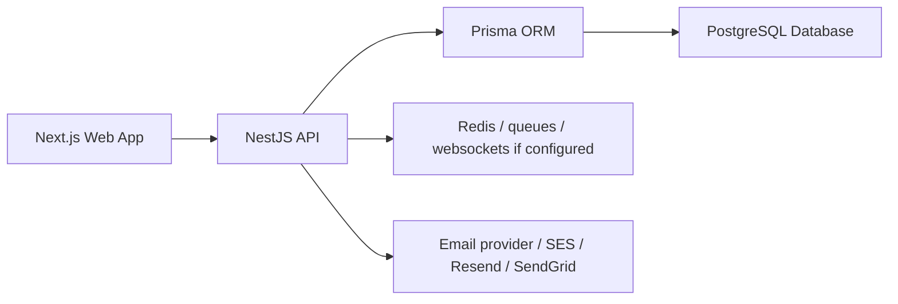
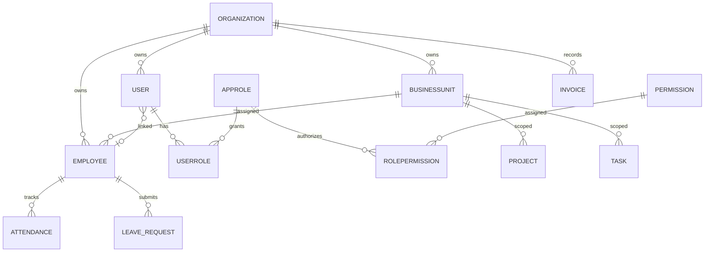
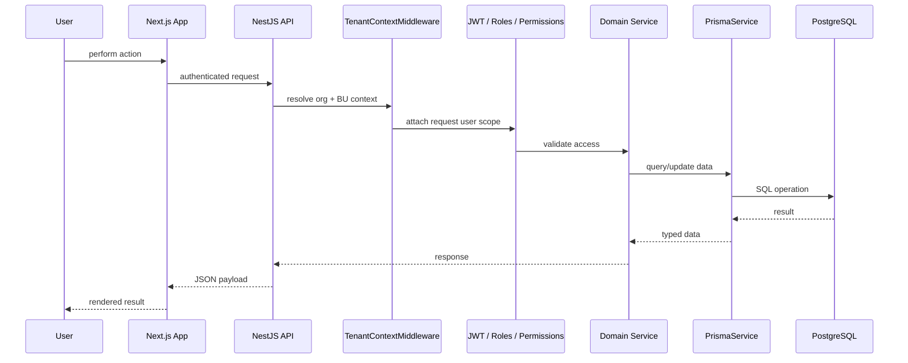

# ERP Overview & Setup

## Table of Contents

1. [Purpose and current scope](#purpose-and-current-scope)
2. [Product overview](#product-overview)
3. [Architecture and technology stack](#architecture-and-technology-stack)
4. [Module-wise overview](#module-wise-overview)
5. [Database overview and important relationships](#database-overview-and-important-relationships)
6. [Administration, roles, permissions, and multi-tenancy](#administration-roles-permissions-and-multi-tenancy)
7. [Local setup and configuration](#local-setup-and-configuration)
8. [System architecture and request flow](#system-architecture-and-request-flow)
9. [Current behavior, known issues, and historical changes](#current-behavior-known-issues-and-historical-changes)
10. [Cross-references](#cross-references)

## Purpose and current scope

This ERP is the current application implemented in this workspace: a multi-tenant NestJS backend, a Next.js frontend, and a Prisma-backed relational database. The codebase is broader than a single HR or CRM module and includes user identity, organization hierarchy, business-unit scoping, attendance, payroll, projects, CRM, finance, workflows, notifications, and auditing.

The documentation below reflects the actual current implementation from these source files:

- `api/src/app.module.ts`
- `api/src/config/env.ts`
- `api/prisma/schema.prisma`
- `api/src/auth/auth.service.ts`
- `api/src/business-units/business-units.service.ts`
- `api/src/organizations/organizations.service.ts`
- `api/src/users/users.service.ts`
- `api/src/common/middleware/tenant-context.middleware.ts`

## Product overview

The ERP is designed as a modular business platform for:

- HR and employee administration
- attendance and leave workflows
- payroll and payslip generation
- CRM and sales tracking
- project, task, and timesheet tracking
- invoices, ledger, expenses, and payments
- organization hierarchy and business-unit scoping
- approvals, notifications, and audit logging

The product is structured as a monorepo with two primary runtime applications:

- API: `api/` using NestJS
- Frontend: `web/` using Next.js

The backend is the authoritative system of record. The frontend is a role-aware portal that calls the API and relies on JWT auth, org selection, and BU scoping.

## Architecture and technology stack

### System components



### Technology stack

- Frontend: Next.js 16 + React 19 + TypeScript
- Backend: NestJS 11 + TypeScript
- Database: PostgreSQL via Prisma ORM
- Auth: JWT + cookies + passport-jwt
- Access control: role guard + permissions guard + org/BU scoping middleware
- Runtime support: optional Redis, BullMQ queues, web sockets, and email provider integrations
- Deployment: Vercel for API and frontend targets

### Backend and API structure

The API is organized into domain modules and shared infrastructure:

- `api/src/app.module.ts` is the root application module
- `api/src/domains/*.module.ts` groups business domains
- `api/src/auth/` handles identity and token generation
- `api/src/users/`, `api/src/organizations/`, `api/src/business-units/` handle tenant and RBAC setup
- `api/src/workflows/` handles workflow logic
- `api/src/notifications/` and `api/src/audit-logs/` handle audit and user communication
- `api/src/common/` contains reusable guards, middleware, types, and filters

## Module-wise overview

### Identity and access

- `User` account lifecycle and authentication
- `AppRole`, `Permission`, `RolePermission`, `UserRole` for permission-based RBAC
- login, password reset, token issuance, and bootstrap admin flows

### HR and operations

- `employees` and related employee records
- `attendance`, `leave-requests`, `employee-self-service`
- `performance`, `ats`, `payroll`
- `tasks`, `timesheets`, `projects`

### CRM and sales

- `leads`, `contacts`, `deals`, `campaign-leads`, `marketing-campaigns`, `quotes`, `tickets`

### Finance and accounting

- `invoices`, `payments`, `ledger-entries`, `expenses`

### Inventory and product management

- `products`

### Notifications, workflow, and audit

- `notifications`
- `workflows`
- audit logs and activity tracking

### Organizations and business units

- hierarchy-driven organization and BU management
- admin-level and platform-admin-level org control
- scoped access for HR or admin roles

## Database overview and important relationships

The source of truth is `api/prisma/schema.prisma`.

### Core models

The live schema includes models such as:

- `User`
- `Organization`
- `BusinessUnit`
- `Employee`
- `Attendance`
- `LeaveRequest`
- `Project`
- `Task`
- `Lead`
- `Deal`
- `Invoice`
- `Payment`
- `Expense`
- `Notification`
- `WorkflowInstance`
- `AuditLog`
- `SystemSetting`

### Important relationships



### Key tenant and ownership rules

- `User.organizationId` is the main tenant pointer for user-owned records.
- `Organization` supports `parentId` hierarchy for org nesting.
- `BusinessUnit` also supports `parentId` hierarchy and is scoped to an organization.
- `Employee` is organization-scoped and optionally linked to a `BusinessUnit`.
- `Project`, `Task`, and other operational records are commonly org-scoped and sometimes BU-scoped.

### Prisma and audit behavior

`api/src/prisma/prisma.service.ts` applies middleware to:

- soft-delete records via `deletedAt` instead of permanent removal
- log create/update/delete actions to `AuditLog`
- redact sensitive values such as passwords and tokens
- resolve organization context for audit entries when possible

## Administration, roles, permissions, and multi-tenancy

### Roles in the schema

The live enum in `schema.prisma` contains the current roles:

- `ADMIN`
- `EMPLOYEE`
- `HR`
- `SUPER_ADMIN`
- `COMPLIANCE_MANAGER`
- `MANAGER`

### Permission model

The code defines permissions in `api/src/common/enums/permissions.enum.ts`. They include access groups for:

- employee management
- payroll
- invoice and finance tasks
- projects
- expense and leave approval
- attendance
- leads and deals
- tasks
- user and role administration

### Access control architecture

The live auth and guard stack is:

- `JwtAuthGuard` for authentication
- `RolesGuard` for role checks
- `PermissionsGuard` for permission checks
- `TenantContextMiddleware` for org and BU resolution

### Platform administration vs organization administration

The current implementation clearly distinguishes between:

- platform-level access (`SUPER_ADMIN`)
- organization-admin access (`ADMIN` in an org context)
- HR / compliance / manager / employee roles

`OrganizationsService` and `BusinessUnitsService` explicitly enforce org access rules. In practice, a platform admin can switch org context through org headers; a non-platform user cannot override org scope.

### Multi-tenant organization structure

The current implementation supports:

- multiple organizations
- organization hierarchy via `parentId`
- child org management by admins under a parent org
- BU hierarchy within an org
- cross-tenant restrictions for ordinary users

### Business-unit scoping rules

Business-unit access is resolved through `BusinessUnitsService.resolveScope()` and `TenantContextMiddleware.resolveBusinessUnitContext()`.

Current behavior:

- wide-scoped roles such as `SUPER_ADMIN`, `ADMIN`, `HR`, and `COMPLIANCE_MANAGER` can scope to all BUs or a selected BU
- non-wide users are limited to their assigned BU
- overrides via `X-Business-Unit-Id` are ignored for non-privileged users

## Local setup and configuration

### Repository layout

```text
enterprise-app/
├─ api/
├─ web/
├─ scripts/
├─ package.json
├─ README.md
├─ deploy.ps1
└─ ...
```

### Root dev commands

From repo root:

```bash
npm install
npm run dev
```

This uses `scripts/dev.js` to start the API and web app concurrently.

### API commands

```bash
cd api
npm install
npx prisma generate
npx prisma validate
npx prisma migrate deploy
npm run dev
```

### Web commands

```bash
cd web
npm install
npm run dev
```

### Environment configuration

The API environment validator is in `api/src/config/env.ts` and enforces required variables for production and dev.

Required categories include:

- `DATABASE_URL`
- `JWT_ACCESS_SECRET`
- `JWT_REFRESH_SECRET`
- `JWT_ISSUER`
- `JWT_AUDIENCE`
- `FRONTEND_URL` or `FRONTEND_ORIGIN`
- `EMAIL_PROVIDER`

Optional but commonly required in production:

- `REDIS_ENABLED`
- `REDIS_URL`
- `WEBSOCKET_ENABLED`
- `EMAIL_*` provider settings
- `BOOTSTRAP_ADMIN_PASSWORD`
- `BOOTSTRAP_SUPER_ADMIN_EMAIL`
- `BOOTSTRAP_SUPER_ADMIN_PASSWORD`

### Production validation rules

The current code explicitly rejects:

- placeholder JWT secrets
- localhost or LAN frontend origins in production
- missing secure cookies in production
- invalid `COOKIE_SAME_SITE` and `COOKIE_SECURE` combinations
- missing email provider configuration

## System architecture and request flow

### Request path



### API bootstrap and CORS

`api/src/create-nest-app.ts` sets up:

- global `/api/v1` prefix
- cookie parsing
- validation pipe
- CORS with trusted origins
- global HTTP interceptors and filters
- app shutdown hooks

### Swagger and developer API docs

`api/src/main.ts` exposes Swagger at `/api` in non-production mode.

## Current behavior, known issues, and historical changes

### Current behavior

The current implementation is operationally a multi-tenant ERP with a hybrid RBAC model. It supports:

- organization hierarchy and child org management
- business-unit hierarchy and unit access control
- JWT auth with cookie and header support
- role and permission-based route guarding
- audit logging on model changes
- soft-delete semantics
- workflow and notification infrastructure
- Vercel deployment configuration for both API and frontend

### Known issues and current status

1. Older documentation files in the repository still describe a more generic ERP and may include outdated instructions.
   - Current status: use the implementation in the codebase as the source of truth.

2. The project uses hybrid RBAC (`User.role` plus `AppRole` / `Permission` records).
   - Current status: this is intentional in the code, but it needs careful review when adding new access checks.

3. Some modules appear broad and partially documented, but not all have fully polished public-facing documentation.
   - Current status: treat unverified module functionality as planned or incomplete until confirmed in code.

4. Production deployment depends on secure configuration and bootstrap secrets.
   - Current status: required deployment prerequisite, not optional.

### Historical changes reflected in repo artifacts

The repository keeps historical documentation and notes such as:

- changelog and architecture notes under `api/docs`
- onboarding notes under `/memories/repo/*`
- earlier product reports and archive materials in historical docs

These are preserved for context, but should not override the current implementation.

## Cross-references

- Development, testing, and deployment: [DEVELOPMENT_TESTING_DEPLOYMENT.md](./DEVELOPMENT_TESTING_DEPLOYMENT.md)
- Technical workflows and code documentation: [TECHNICAL_WORKFLOWS_AND_CODE_DOCUMENTATION.md](./TECHNICAL_WORKFLOWS_AND_CODE_DOCUMENTATION.md)
- Database overview: [DATABASE_OVERVIEW.md](./DATABASE_OVERVIEW.md)


#### Attendance

Attendance stores daily check-in and check-out data.

```prisma
model Attendance {
  id            Int      @id @default(autoincrement())
  employeeId    Int
  date          DateTime
  checkIn       DateTime?
  checkOut      DateTime?
  workingHours  Float?
  lateMinutes   Int      @default(0)
  overtimeHours Float    @default(0)
  status        AttendanceStatus

  @@unique([employeeId, date])
}
```

#### Invoice

Invoices represent billing documents.

```prisma
model Invoice {
  id          Int      @id @default(autoincrement())
  invoiceNo   String   @unique
  status      String   @default("DRAFT")
  totalAmount Float    @default(0)
  userId      Int
}
```

#### Payment

Payments capture invoice settlement.

```prisma
model Payment {
  id            Int      @id @default(autoincrement())
  invoiceId     Int
  amount        Float
  paymentMethod String
  status        String
}
```

### Design Principles

- Shared master entities reduce duplication.
- Transactional records reference master data through IDs.
- Approval history is stored as structured workflow data.
- Unique constraints prevent duplicate operational records.

## 6. API Design

The API uses REST conventions and standardizes responses so the frontend can consume all modules consistently.

### REST Structure

- `GET` for list and read operations.
- `POST` for creating new records.
- `PATCH` for updates and workflow transitions.
- `DELETE` for removal or soft deletion.

### Example Endpoints

- `GET /api/v1/analytics/summary`
- `POST /api/v1/leads`
- `DELETE /api/v1/leads/:id`
- `POST /api/v1/leave-requests`
- `PATCH /api/v1/leave-requests/:id/manager-approve`
- `PATCH /api/v1/attendance/check-in`
- `PATCH /api/v1/attendance/check-out`

### Standard API Response Envelope

```json
{
  "success": true,
  "data": {},
  "error": null
}
```

Error responses follow the same structure with `success: false` and a populated `error` object or message. This makes the frontend simpler, more consistent, and easier to debug.

## 7. Authentication & Authorization

The platform uses JWT-based authentication for secure session handling.

### Authentication Flow

1. User signs in with email and password.
2. Backend validates credentials and issues a JWT.
3. Frontend stores the token and sends it on protected requests.
4. Guards verify the token before allowing access.

### Role-Based Access Control

Supported roles include:

- Admin
- HR
- Manager
- Employee

Role-based access ensures that users only see and modify what they are allowed to access. For example, managers can approve team leave requests, HR can finalize leave approvals, and employees can only submit or edit their own data within policy limits.

## 8. Frontend Architecture

The frontend follows a modular App Router structure suitable for enterprise dashboards.

### Folder Structure

```text
web/
  app/
    dashboard/
    ess/
    login/
  src/
    api/
    components/
    hooks/
    services/
    utils/
```

### Component Design

- Pages provide route-level screens.
- Shared components provide tables, dashboards, and action controls.
- Feature-specific hooks encapsulate API calls and state transitions.
- Layouts enforce authentication and role-aware navigation.

### API Client Handling

The frontend uses a typed API client layer to centralize backend access, reduce repetitive fetch logic, and keep request/response shapes consistent.

### State Management Approach

The application relies primarily on React component state and feature hooks. This is appropriate for a modular ERP because most state is local to a page, a workflow, or a data grid rather than a global real-time store.

## 9. Testing Strategy

The platform uses layered testing to protect both business rules and user flows.

### Unit Tests

- Validate isolated service logic.
- Confirm workflow rules such as approval transitions and attendance constraints.

### E2E Tests

- Verify complete user journeys.
- Confirm controllers, services, and persistence work together.

### Contract Testing

- Protect API shapes consumed by the frontend.
- Reduce regressions in dashboard and workflow endpoints.

### Smoke Tests

- Quickly validate that critical reports and modules load.
- Useful after deployment or schema changes.

## 10. Error Handling & Logging

The backend uses structured error handling so clients receive meaningful failures and operators can diagnose issues quickly.

### Global Exception Strategy

- Authentication errors return unauthorized responses.
- Validation errors return bad request responses with clear messages.
- Not-found and forbidden errors communicate workflow or access issues.

### API Error Structure

```json
{
  "success": false,
  "data": null,
  "error": {
    "message": "Leave request is not pending manager approval"
  }
}
```

### Debugging Approach

- Use backend logs to identify workflow failures.
- Use dashboard state and status fields to trace user actions.
- Use approval trails and audit records to reconstruct historical behavior.

## 11. Deployment Strategy

### Local Development Setup

1. Install dependencies in the frontend and backend.
2. Start the NestJS API on port 3000.
3. Start the Next.js frontend on port 3001.
4. Confirm the frontend can reach the backend through CORS-enabled requests.

### Environment Variables

Typical required configuration includes:

- `DATABASE_URL`
- `JWT_SECRET`
- `JWT_EXPIRATION`
- `FRONTEND_URL`
- `REDIS_URL` or Redis host and port if queues are enabled

### Production Deployment Overview

- Deploy the frontend to a web host or container platform.
- Deploy the NestJS API separately behind a secure reverse proxy.
- Run Prisma migrations during release deployment.
- Monitor API errors, database health, and workflow throughput.

## 12. Known Issues & Troubleshooting

### ECONNREFUSED

Cause: The backend API is not running or the frontend is pointing to the wrong port.

Fix:

- Start the API on port 3000.
- Confirm the frontend is using the correct base URL.
- Ensure CORS allows the frontend origin.

### Prisma Schema Mismatch

Cause: The code and database schema are out of sync after a migration change.

Fix:

- Run the Prisma migration workflow.
- Regenerate the Prisma client.
- Restart the backend and refresh the TypeScript environment.

### Undefined Variables in React

Cause: A component references data before it has loaded.

Fix:

- Add loading states.
- Guard against null or undefined values.
- Verify hook return values before rendering.

### Migration Errors

Cause: Conflicting schema history or incomplete migration execution.

Fix:

- Review migration files for drift.
- Reconcile schema changes before release.
- Ensure database permissions and connection settings are correct.

## 13. Future Enhancements

- AI-assisted analytics and forecasting.
- Mobile application for approvals and field access.
- Multi-tenant architecture for multiple companies.
- More granular role-based dashboards.
- Advanced reporting warehouse for historical trend analysis.
- Queue-based notifications for email, SMS, and push delivery.

## 14. Conclusion

This ERP/CRM platform provides a scalable and extensible foundation for managing customers, employees, finances, attendance, payroll, and analytics in a single system. Its modular architecture, shared relational database, workflow enforcement, and role-based access controls make it suitable for growing organizations that need both operational efficiency and trustworthy reporting.

The system is designed to evolve. New modules, approvals, reports, and integrations can be added without disrupting the core platform, which is exactly what enterprise software needs to support long-term growth.