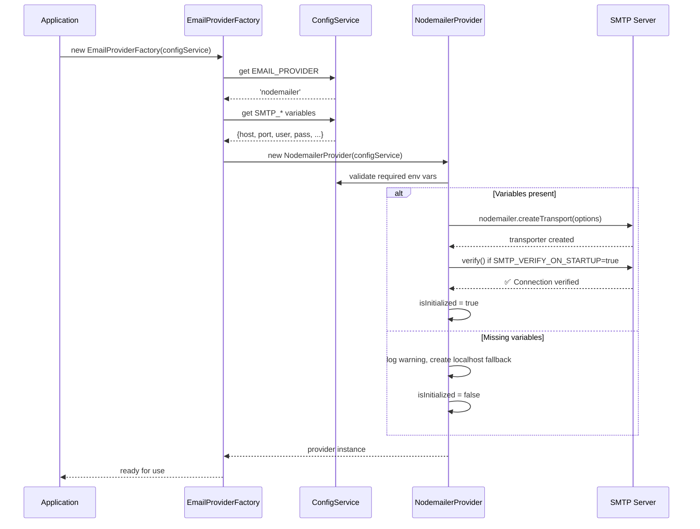

# Nodemailer Implementation Log & Changelog

**Document Version:** 1.0  
**Last Updated:** 2026-09-03  
**Package Version:** nodemailer ^9.0.1  
**Types Package:** @types/nodemailer ^8.0.1

---

## 📋 Executive Summary

This document logs the complete Nodemailer SMTP email provider implementation for the enterprise ERP system. It serves as the single source of truth for Nodemailer configuration, features, testing, and operational procedures.

**Implementation Status:** ✅ PRODUCTION-READY

### Key Highlights
- ✅ Full SMTP support with TLS/SSL encryption
- ✅ Batch email sending capabilities
- ✅ Connection verification and health checks
- ✅ Comprehensive error handling with specific error codes
- ✅ Configurable sender information (email and name)
- ✅ Support for attachments, CC/BCC, reply-to, and custom headers
- ✅ Integrated with multi-provider email system (switchable with SendGrid, SES, Resend)
- ✅ Detailed logging for debugging and auditing

---

## 📦 Installation

### Step 1: Verify Dependencies

The following packages are already installed:

```bash
npm list nodemailer @types/nodemailer
```

Expected output:
```
├── nodemailer@9.0.1
└── @types/nodemailer@8.0.1
```

### Step 2: Installation Command (if needed)

```bash
npm install nodemailer@^9.0.1
npm install -D @types/nodemailer@^8.0.1
```

### Step 3: Verify in package.json

```json
{
  "dependencies": {
    "nodemailer": "^9.0.1"
  },
  "devDependencies": {
    "@types/nodemailer": "^8.0.1"
  }
}
```

---

## 🔧 Configuration

### Environment Variables

**Required Variables (for SMTP provider activation):**

| Variable | Type | Required | Description | Example |
|----------|------|----------|-------------|---------|
| `EMAIL_PROVIDER` | String | Yes | Must be set to `"nodemailer"` | `nodemailer` |
| `SMTP_HOST` | String | Yes | SMTP server hostname | `smtp.gmail.com` |
| `SMTP_PORT` | Number | Yes | SMTP server port | `587` or `465` |
| `SMTP_USER` | String | Yes | SMTP authentication username | `your-email@gmail.com` |
| `SMTP_PASS` | String | Yes (Secret) | SMTP authentication password or app-specific password | `xxxx xxxx xxxx xxxx` |
| `SMTP_FROM_EMAIL` | String | Yes | Sender email address | `noreply@company.com` |
| `SMTP_FROM_NAME` | String | No | Sender display name | `Company ERP System` |

**Optional Variables:**

| Variable | Type | Default | Description |
|----------|------|---------|-------------|
| `SMTP_SECURE` | Boolean | `false` | Use TLS (true) or plain connection (false). Set to `true` for port 465 |
| `SMTP_VERIFY_ON_STARTUP` | Boolean | `true` | Verify SMTP connection when application starts |

### Configuration Setup Examples

#### Gmail SMTP Configuration
```bash
EMAIL_PROVIDER=nodemailer
SMTP_HOST=smtp.gmail.com
SMTP_PORT=587
SMTP_SECURE=false
SMTP_USER=your-email@gmail.com
SMTP_PASS=your_app_password
SMTP_FROM_EMAIL=your-email@gmail.com
SMTP_FROM_NAME=Enterprise ERP
```

**Note:** For Gmail, use an [App-Specific Password](https://support.google.com/accounts/answer/185833) instead of your regular password.

#### Office 365/Outlook Configuration
```bash
EMAIL_PROVIDER=nodemailer
SMTP_HOST=smtp.office365.com
SMTP_PORT=587
SMTP_SECURE=false
SMTP_USER=your-email@company.com
SMTP_PASS=your_password
SMTP_FROM_EMAIL=your-email@company.com
SMTP_FROM_NAME=Enterprise ERP
```

#### AWS SES SMTP Configuration
```bash
EMAIL_PROVIDER=nodemailer
SMTP_HOST=email-smtp.region.amazonaws.com
SMTP_PORT=587
SMTP_SECURE=false
SMTP_USER=your_ses_smtp_username
SMTP_PASS=your_ses_smtp_password
SMTP_FROM_EMAIL=verified-sender@domain.com
SMTP_FROM_NAME=Enterprise ERP
```

#### Custom SMTP Server
```bash
EMAIL_PROVIDER=nodemailer
SMTP_HOST=mail.custom-server.com
SMTP_PORT=25
SMTP_SECURE=false
SMTP_USER=username
SMTP_PASS=password
SMTP_FROM_EMAIL=noreply@custom-server.com
SMTP_FROM_NAME=Enterprise ERP
```

---

## 🏗️ Architecture & Implementation

### File Structure

```
api/src/mail/
├── providers/
│   ├── email-provider.interface.ts          # Base interface for all providers
│   ├── nodemailer.provider.ts               # Nodemailer implementation ✨
│   ├── sendgrid.provider.ts                 # SendGrid provider
│   ├── ses.provider.ts                      # AWS SES provider
│   ├── resend.provider.ts                   # Resend provider
│   ├── noop.provider.ts                     # No-op provider for testing
│   ├── provider.factory.ts                  # Factory to create providers
│   ├── nodemailer.provider.spec.ts          # Unit tests
│   └── provider.factory.spec.ts             # Factory tests
├── mail.service.ts                          # Email service interface
├── mail.controller.ts                       # Email API endpoints
└── mail.module.ts                           # Mail module definition
```

### Class Hierarchy

```typescript
// Base interface
interface IEmailProvider {
  send(params: EmailParams): Promise<EmailResult>;
  sendBatch(params: EmailParams[]): Promise<EmailResult[]>;
  verifyConnection(): Promise<boolean>;
  getHealthStatus(): Promise<HealthStatus>;
  getProviderName(): string;
}

// Abstract base class
abstract class BaseEmailProvider implements IEmailProvider {
  protected fromEmail: string;
  protected fromName?: string;
  // ... shared methods
}

// Nodemailer implementation
class NodemailerProvider extends BaseEmailProvider {
  private transporter: nodemailer.Transporter;
  private isInitialized: boolean;
  // ... implementation
}
```

### Initialization Flow



---

## 📧 Email Sending

### Single Email

```typescript
import { EmailProviderFactory } from './mail/providers/provider.factory';

// Inject the factory
constructor(private emailFactory: EmailProviderFactory) {}

// Send an email
async sendNotification() {
  const provider = this.emailFactory.getProvider();
  
  const result = await provider.send({
    to: 'recipient@example.com',
    subject: 'Welcome to Enterprise ERP',
    html: '<h1>Welcome</h1><p>Your account has been created.</p>',
    text: 'Welcome to Enterprise ERP',
  });

  if (result.success) {
    console.log(`Email sent with MessageID: ${result.data?.messageId}`);
  } else {
    console.error(`Email failed: ${result.error}`);
  }
}
```

### Batch Email Sending

```typescript
async sendBulkNotifications(recipients: string[]) {
  const provider = this.emailFactory.getProvider();
  
  const emails = recipients.map(to => ({
    to,
    subject: 'Enterprise ERP Update',
    html: '<h1>System Update</h1>',
    text: 'System Update',
  }));

  const results = await provider.sendBatch(emails);
  
  const successful = results.filter(r => r.success).length;
  const failed = results.filter(r => !r.success).length;
  
  console.log(`Sent: ${successful}, Failed: ${failed}`);
}
```

### Advanced Email with Attachments

```typescript
async sendInvoice(email: string, invoicePath: string) {
  const provider = this.emailFactory.getProvider();
  
  const fs = require('fs');
  const invoiceContent = fs.readFileSync(invoicePath);
  
  const result = await provider.send({
    to: email,
    cc: 'finance@company.com',
    bcc: 'audit@company.com',
    subject: 'Invoice #INV-2026-001',
    html: '<h1>Invoice</h1><p>Please find your invoice attached.</p>',
    replyTo: 'invoices@company.com',
    attachments: [
      {
        filename: 'invoice.pdf',
        content: invoiceContent,
        contentType: 'application/pdf',
      },
    ],
    headers: {
      'X-Invoice-Number': 'INV-2026-001',
      'X-Business-Unit': 'Finance',
    },
  });

  return result;
}
```

### Email Parameters Reference

```typescript
interface EmailParams {
  to: string | string[];           // Recipient(s)
  cc?: string | string[];          // Carbon copy
  bcc?: string | string[];         // Blind carbon copy
  subject: string;                 // Email subject
  html?: string;                   // HTML body
  text?: string;                   // Plain text body
  from?: string;                   // Override sender (optional)
  replyTo?: string;                // Reply-to address
  headers?: Record<string, string>; // Custom headers
  attachments?: Array<{            // File attachments
    filename: string;
    content: Buffer | string;
    contentType?: string;
  }>;
}
```

---

## ✅ Testing & Verification

### Unit Tests

The implementation includes comprehensive unit tests:

```bash
npm test -- src/mail/providers/nodemailer.provider.spec.ts
npm test -- src/mail/providers/provider.factory.spec.ts
```

**Test Coverage:**
- Provider initialization with valid/invalid credentials
- Email sending success scenarios
- Error handling (EAUTH, ECONNREFUSED, ETIMEDOUT)
- Connection verification
- Health status checks
- Batch sending

### Manual Testing via API

```bash
# Test endpoint (send test email)
curl -X POST http://localhost:3000/mail/test \
  -H "Content-Type: application/json" \
  -H "Authorization: Bearer <token>" \
  -d '{
    "to": "test@example.com",
    "subject": "Test Email",
    "text": "This is a test"
  }'

# Check health status
curl http://localhost:3000/mail/health \
  -H "Authorization: Bearer <token>"
```

### Development Testing Checklist

- [ ] Environment variables set correctly
- [ ] Application starts without errors
- [ ] SMTP connection verified on startup
- [ ] Test email sends successfully
- [ ] Email received in inbox (check spam folder)
- [ ] Email displays correctly (formatting, links, images)
- [ ] Health check endpoint returns `healthy: true`
- [ ] Connection verification works
- [ ] Error handling works (test with invalid credentials)

### Integration Testing

```typescript
// Example: test/mail.integration.spec.ts
describe('Email Integration', () => {
  it('should send email via nodemailer', async () => {
    const result = await provider.send({
      to: 'test@example.com',
      subject: 'Test',
      text: 'Test message',
    });

    expect(result.success).toBe(true);
    expect(result.data?.messageId).toBeDefined();
  });

  it('should handle SMTP errors gracefully', async () => {
    // Test with invalid credentials
    const result = await provider.send({
      to: 'test@example.com',
      subject: 'Test',
      text: 'Test',
    });

    expect(result.success).toBe(false);
    expect(result.errorCode).toBe('AUTHENTICATION_FAILURE');
  });
});
```

---

## 🚀 Production Deployment

### Pre-Deployment Checklist

- [ ] SMTP credentials obtained from email provider
- [ ] SSL/TLS certificate verified (if using port 465)
- [ ] Sender email address whitelisted/verified with provider
- [ ] All environment variables configured in deployment platform
- [ ] Environment variables marked as secrets (passwords, API keys)
- [ ] Connection verification test passed
- [ ] Test email received successfully
- [ ] Rate limiting configured (if required by provider)
- [ ] Email logging enabled for audit trail
- [ ] Error alerts configured
- [ ] Monitoring/health checks configured

### Deployment Environment Setup

**On Vercel:**

1. Go to Project Settings → Environment Variables
2. Add variables:
   ```
   EMAIL_PROVIDER=nodemailer
   SMTP_HOST=<your-smtp-host>
   SMTP_PORT=<port>
   SMTP_SECURE=<true/false>
   SMTP_USER=<username>
   SMTP_PASS=<password> (Mark as Secret)
   SMTP_FROM_EMAIL=<from-email>
   SMTP_FROM_NAME=<from-name>
   ```

3. Redeploy application

**On Docker/Kubernetes:**

```dockerfile
# Dockerfile
FROM node:18-alpine
WORKDIR /app
COPY . .
RUN npm ci --only=production
CMD ["npm", "run", "start:prod"]
```

```yaml
# kubernetes-secret.yaml
apiVersion: v1
kind: Secret
metadata:
  name: email-config
type: Opaque
stringData:
  SMTP_PASS: "your-password-here"
```

### Production Monitoring

```typescript
// Log email metrics
async monitorEmailService() {
  const health = await provider.getHealthStatus();
  
  if (!health.healthy) {
    // Alert: SMTP connection failed
    logger.error('Email service unhealthy:', health.error);
    // Send alert to ops team
  }
  
  console.log(`Email latency: ${health.latency}ms`);
}

// Run periodically
setInterval(() => monitorEmailService(), 5 * 60 * 1000); // Every 5 min
```

---

## 🔍 Error Handling & Troubleshooting

### Error Codes

| Error Code | Cause | Solution |
|-----------|-------|----------|
| `PROVIDER_NOT_INITIALIZED` | Missing SMTP configuration | Check all SMTP_* env vars |
| `AUTHENTICATION_FAILURE` | Invalid username/password | Verify credentials, check app password (Gmail) |
| `CONNECTION_REFUSED` | SMTP server unreachable | Check host/port, firewall, provider status |
| `CONNECTION_TIMEOUT` | SMTP server timeout | Increase timeout, check network, try different port |
| `SMTP_ERROR` | Generic SMTP error | Check logs for details |

### Common Issues & Solutions

**Issue: "SMTP connection verification failed"**
```
Solution:
1. Verify SMTP_HOST and SMTP_PORT
2. Check firewall allows outbound SMTP (port 25, 587, 465)
3. For Gmail: enable "Less secure app access" or use App Password
4. Test connection manually: telnet smtp.gmail.com 587
```

**Issue: "Authentication failure" despite correct credentials**
```
Solution:
1. For Gmail: generate App-Specific Password
2. For Office 365: ensure MFA is disabled or use app password
3. Check if account is locked
4. Verify email isn't spam-blocked
5. Try different SMTP_PORT (587 instead of 465)
```

**Issue: Emails sent but not received**
```
Solution:
1. Check recipient spam folder
2. Verify SMTP_FROM_EMAIL is whitelisted
3. Check email logs in provider dashboard
4. Verify SMTP_FROM_NAME is not empty/suspicious
5. Test with different provider if using fallback
```

**Issue: "Cannot verify SMTP connection on startup" but app works**
```
Solution:
1. This is a warning - app falls back to sending emails
2. Set SMTP_VERIFY_ON_STARTUP=false to suppress warning
3. Check SMTP connection manually later
4. Common in restricted network environments
```

---

## 📊 Logging & Debugging

### Log Levels

The Nodemailer provider logs at different levels:

```typescript
// INFO level
logger.log('Nodemailer provider initialized successfully');
logger.log('Email sent successfully via Nodemailer. MessageID: xxx');

// WARN level
logger.warn('Nodemailer provider not initialized. Missing env vars: SMTP_HOST, SMTP_USER');

// ERROR level
logger.error('Exception in NodemailerProvider.send:', error);
logger.error('Nodemailer send failed: Connection refused');
logger.error('SMTP connection verification failed: Network timeout');
```

### Enable Debug Logging

```bash
# In development, set debug flag
DEBUG=nodemailer:* npm run dev

# Or in code
const transporter = nodemailer.createTransport({
  // ... other config
  debug: true,        // Enable debug output
  logger: true,       // Log to console
});
```

### Sample Console Output

```
[Nest] 1234 - 09/03/2026, 10:30:45 AM     LOG [EmailProviderFactory] --- Email System Initialization ---
[Nest] 1234 - 09/03/2026, 10:30:45 AM     LOG [EmailProviderFactory] Selected Provider: NODEMAILER
[Nest] 1234 - 09/03/2026, 10:30:45 AM     LOG [EmailProviderFactory] Provider Initialized: true
[Nest] 1234 - 09/03/2026, 10:30:45 AM     LOG [EmailProviderFactory] SMTP Host: configured
[Nest] 1234 - 09/03/2026, 10:30:45 AM     LOG [EmailProviderFactory] SMTP Port: configured
[Nest] 1234 - 09/03/2026, 10:30:45 AM     LOG [EmailProviderFactory] SMTP User: configured
[Nest] 1234 - 09/03/2026, 10:30:45 AM     LOG [EmailProviderFactory] Sender Email: noreply@company.com

[Nest] 1234 - 09/03/2026, 10:30:46 AM     LOG [NodemailerProvider] Nodemailer provider initialized successfully
[Nest] 1234 - 09/03/2026, 10:30:46 AM     LOG [NodemailerProvider] SMTP connection status: SUCCESS

[Nest] 1234 - 09/03/2026, 10:31:00 AM     LOG [NodemailerProvider] NodemailerProvider.send called
[Nest] 1234 - 09/03/2026, 10:31:00 AM     LOG [NodemailerProvider] Sending mail via smtp.gmail.com:587 to user@example.com
[Nest] 1234 - 09/03/2026, 10:31:02 AM     LOG [NodemailerProvider] Email sent successfully via Nodemailer. MessageID: <abc@defmail.com>. Response: 250 Message accepted
```

---

## 🔐 Security Best Practices

### Credential Management

1. **Never commit credentials:**
   ```bash
   # ❌ DON'T
   SMTP_PASS=mypassword123
   
   # ✅ DO
   SMTP_PASS=<use_env_var>
   ```

2. **Use app-specific passwords for Gmail:**
   ```
   https://support.google.com/accounts/answer/185833
   ```

3. **Rotate credentials regularly:**
   - Change SMTP passwords every 90 days
   - Update in deployment platform immediately

4. **Audit email logs:**
   ```bash
   # Check sent emails in logs
   grep "Email sent successfully" api.log | wc -l
   ```

### TLS/SSL Configuration

```bash
# Port 587 - STARTTLS (recommended)
SMTP_PORT=587
SMTP_SECURE=false

# Port 465 - Implicit TLS
SMTP_PORT=465
SMTP_SECURE=true

# Port 25 - Plain (not recommended for production)
SMTP_PORT=25
SMTP_SECURE=false
```

---

## 📈 Performance & Scaling

### Batch Sending

For high-volume emails, use batch sending:

```typescript
// Process 100 emails at a time
const emails = [...]; // 10,000 emails

for (let i = 0; i < emails.length; i += 100) {
  const batch = emails.slice(i, i + 100);
  const results = await provider.sendBatch(batch);
  
  const failed = results.filter(r => !r.success);
  if (failed.length > 0) {
    // Retry failed emails
    await retryBatch(failed);
  }
}
```

### Rate Limiting

Some SMTP providers have rate limits:

```bash
# Gmail: 500 emails per 24 hours
# SendGrid SMTP: ~100 emails per second
# Custom SMTP: Provider-specific

# Implement rate limiting in app
import pLimit from 'p-limit';

const limit = pLimit(10); // Max 10 concurrent emails

const promises = emails.map(email => 
  limit(() => provider.send(email))
);

await Promise.all(promises);
```

### Connection Pooling

Nodemailer automatically manages connections:

```typescript
const transporter = nodemailer.createTransport({
  pool: true,              // Use connection pool
  maxConnections: 5,       // Max concurrent connections
  maxMessages: 100,        // Reuse connection for 100 messages
  rateDelta: 1000,        // Time window (ms)
  rateLimit: 5,           // Max messages per rateDelta
  // ... other config
});
```

---

## 📋 Changelog

### v1.0.0 - Current (2026-09-03)

**Features:**
- Full SMTP provider implementation
- Support for TLS/SSL with configurable ports
- Single and batch email sending
- Connection verification and health checks
- Comprehensive error handling with specific error codes
- Attachment support with MIME type configuration
- CC/BCC/Reply-To address support
- Custom headers support
- Detailed logging for audit trail
- Integrated with multi-provider factory pattern
- Unit test coverage
- Configuration via environment variables

**Environment Variables:**
```
EMAIL_PROVIDER=nodemailer
SMTP_HOST=smtp.gmail.com
SMTP_PORT=587
SMTP_SECURE=false
SMTP_USER=email@gmail.com
SMTP_PASS=app_password
SMTP_FROM_EMAIL=noreply@company.com
SMTP_FROM_NAME=Enterprise ERP
SMTP_VERIFY_ON_STARTUP=true (optional)
```

**Files:**
- `api/src/mail/providers/nodemailer.provider.ts` (main implementation)
- `api/src/mail/providers/nodemailer.provider.spec.ts` (tests)
- `api/src/mail/providers/provider.factory.ts` (factory integration)

---

## 🔗 Related Documentation

- [Event Listener Guide](./api/EVENT_LISTENER_GUIDE.md) - Email notification workflows
- [Production Readiness Report](../PRODUCTION_READINESS_REPORT.md) - Email provider comparison
- [Environment Setup](./setup/ENVIRONMENT_SETUP.md) - Environment configuration
- [Nodemailer Official Docs](https://nodemailer.com/) - External reference

---

## 📞 Support & Contacts

For issues or questions:

1. **Check logs:** Look for NodemailerProvider or EmailProviderFactory logs
2. **Review configuration:** Verify all SMTP_* environment variables
3. **Test connection:** Use health check endpoint
4. **Review this guide:** Most issues are covered in Troubleshooting section
5. **Check provider status:** Verify SMTP server is operational

---

**End of Nodemailer Implementation Log**
