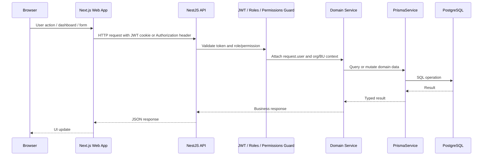
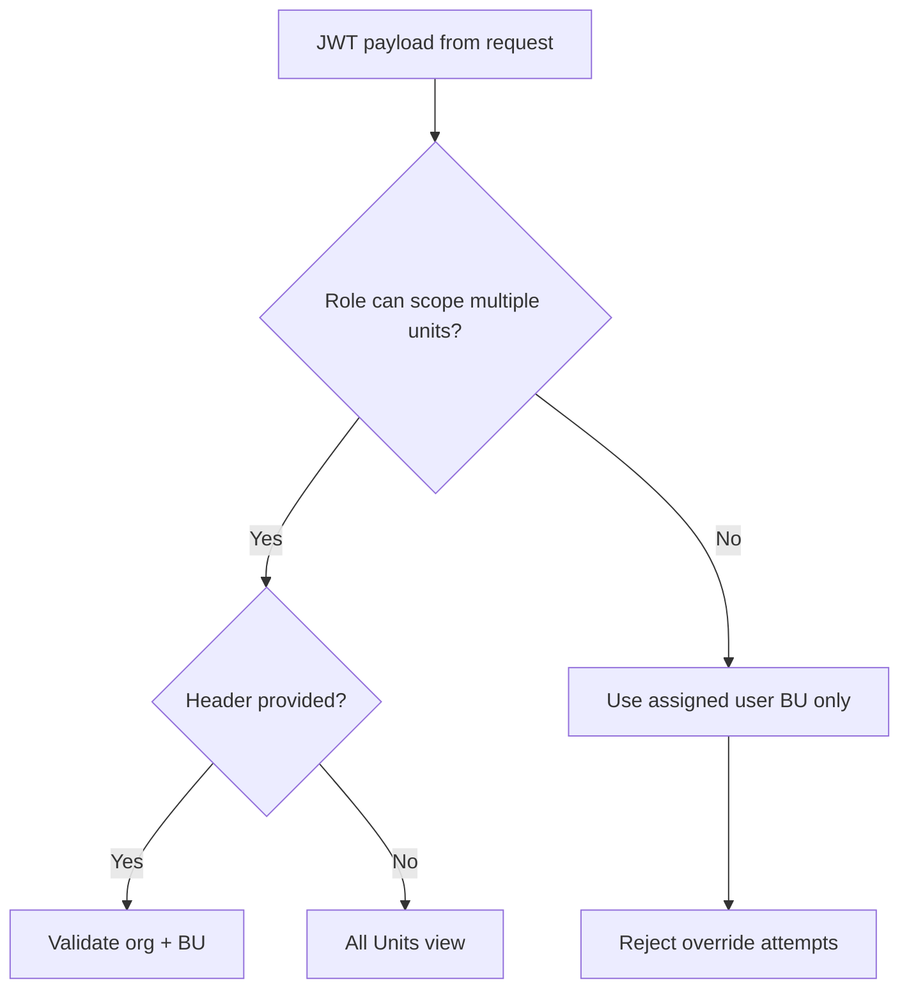
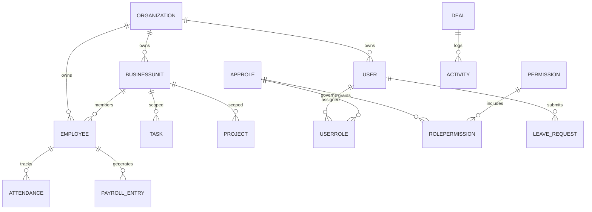

# Technical Workflows & Code Documentation

## Table of Contents

1. [Purpose and scope](#purpose-and-scope)
2. [High-level architecture and request flow](#high-level-architecture-and-request-flow)
3. [Authentication and authorization flow](#authentication-and-authorization-flow)
4. [Organization and business-unit model](#organization-and-business-unit-model)
5. [Module-to-module dependencies](#module-to-module-dependencies)
6. [Database model relationships](#database-model-relationships)
7. [Core workflow narratives](#core-workflow-narratives)
8. [Key code areas and why they matter](#key-code-areas-and-why-they-matter)
9. [Error catalog](#error-catalog)
10. [Debugging procedures](#debugging-procedures)
11. [Known issues and limitations](#known-issues-and-limitations)
12. [Cross-references](#cross-references)

## Purpose and scope

This document explains how the ERP behaves internally, which code paths enforce access control, and how data flows from the web front end through the API to the database. It is meant to support technical investigation, onboarding, and support diagnosis.

The implementation source of truth is the current application code and Prisma schema in the workspace.

## High-level architecture and request flow



### Request flow details

1. The app is bootstrapped in `api/src/main.ts` and `api/src/create-nest-app.ts`.
2. `AppModule` registers middleware and domain modules.
3. `TenantContextMiddleware` resolves tenant and BU context for the request.
4. `JwtStrategy` reads the access token from the cookie or `Authorization` header.
5. `RolesGuard` and `PermissionsGuard` enforce route access.
6. The domain service validates org membership and business-unit scope before reading or writing data.
7. Prisma middleware logs changes and applies soft-delete patterns.

## Authentication and authorization flow

### Authentication stack

The live auth path is built around:

- `api/src/auth/auth.service.ts`
- `api/src/auth/jwt.strategy.ts`
- `api/src/auth/jwt-auth.guard.ts`
- `api/src/common/guards/roles.guard.ts`
- `api/src/common/guards/permissions.guard.ts`

### JWT and cookie handling

The app reads the access token from either:

- `enterprise_access_token` cookie
- `Authorization: Bearer ...` header

The token payload includes fields such as:

- `sub` / `userId`
- `email`
- `role`
- `roles`
- `permissions`
- `organizationId`
- `primaryBusinessUnitId`
- `employeeBusinessUnitId`
- `tokenType`

The `AuthService.login()` flow creates tokens after reconciling the user, roles, and organization metadata.

### Role and permission model

The codebase supports both a legacy scalar role model and a newer app-role / permission model:

- legacy scalar: `User.role` with enum `Role`
- app RBAC: `AppRole`, `Permission`, `RolePermission`, `UserRole`

`AuthService` builds the token payload by merging both sets of role data.

### Authorization enforcement

The actual gate logic is implemented in:

- `RolesGuard.canActivate()`
- `PermissionsGuard.canActivate()`

Important rules:

- platform admins are allowed to bypass route restrictions in some contexts
- `SUPER_ADMIN` and `ADMIN` are treated as platform privileged roles
- permission checks are applied separately and can still reject privileged users if they are missing required permissions

## Organization and business-unit model

### Organization hierarchy

The Prisma model `Organization` supports parent-child hierarchy:

```prisma
model Organization {
  id       Int
  parentId Int?
  children Organization[]
  parent   Organization?
  users    User[]
  businessUnits BusinessUnit[]
}
```

This is consumed in `OrganizationsService` and `BusinessUnitsService`.

### Business unit hierarchy

`BusinessUnit` has its own parent-child tree and is scoped to an organization:

```prisma
model BusinessUnit {
  id             Int
  organizationId Int
  parentId       Int?
  status         BusinessUnitStatus
}
```

The service contains logic to:

- validate parent relationships
- reject cycles
- collect descendant IDs
- enforce active-unit checks
- allow wide-scoped roles to select all units or a single BU

### Business-unit scoping behavior

`TenantContextMiddleware` resolves context using headers:

- `X-Organization-Id`
- `X-Business-Unit-Id`

and it intentionally ignores override attempts from non-privileged users.



## Module-to-module dependencies

### Domain modules

The application groups code using domain modules:

- `CoreModule`
- `IdentityModule`
- `HrModule`
- `CrmModule`
- `ProjectsDomainModule`
- `FinanceModule`
- `InventoryModule`
- `NotificationsDomainModule`
- `OperationsModule`
- `DynamicFormsModule`
- `FormSubmissionsModule`
- `OrganizationsModule`
- `BusinessUnitsModule`
- `EmailModule`

### Examples of cross-module dependency paths

- HR modules rely on `Users`, `Employees`, `Attendance`, `LeaveRequests`, `Payroll`.
- Project flows depend on `BusinessUnitsService` for access scoping and `Tasks` for assignment.
- Finance domain depends on `Invoices`, `Payments`, `LedgerEntries`, `Expenses`.
- CRM modules include leads, deals, contacts, marketing, tickets, and quotes.
- Notification and workflow modules are used by approval business processes.

## Database model relationships

### Tenant ownership pattern

Most records are tied back to an organization through `organizationId` and many have additional BU or employee references. The central relationship pattern is:

- `Organization` owns `User`, `Employee`, projects, tasks, leads, invoice records, etc.
- `BusinessUnit` belongs to an `Organization`
- `Employee` belongs to an `Organization` and can belong to a `BusinessUnit`
- `User` belongs to an organization and may also carry a primary business unit

### Important relationships



### Data integrity and audit behavior

`PrismaService` applies:

- soft delete middleware
- audit logging middleware
- sensitive field redaction
- organization resolution for audit entries

This means most data changes record not just the action, but the entity, field, before/after values, and actor metadata.

## Core workflow narratives

### 1. User login and JWT issuance

`AuthService.login()` performs:

- user lookup by email
- active account validation
- password verification
- employee link reconciliation
- role + permission collection
- token issuance with org and BU metadata

### 2. Organization selection and tenant context

The code uses `organizationId` from the token and can accept override headers for platform admins. This is especially relevant for `SUPER_ADMIN` flows.

### 3. Business-unit-scoped resource access

Before reading records, services call `BusinessUnitsService.resolveScope()` or equivalent checks. This adds a `where` filter based on organization and BU access.

### 4. Workflow approval and assignment

The app includes `WorkflowModule` and `WorkflowEngineService`, which support workflow definitions and approval-based processes. The workflow engine supports roles and entity-based workflow routing.

### 5. Notification and activity generation

The audit and activity models attach to operations across entities. Notifications are treated as part of business process events rather than a single post-login channel only.

## Key code areas and why they matter

### `api/src/app.module.ts`

This is the composition root for the backend. It registers global configuration, caching, queue, event emitting, throttling, and middleware.

### `api/src/create-nest-app.ts`

This configures global prefixing, CORS, cookie parsing, validation, and error filters.

### `api/src/config/env.ts`

This is the central security and environment validation layer. It enforces production requirements and rejects insecure defaults.

### `api/src/auth/auth.service.ts`

This is the main authentication engine: login, password reset, bootstrap, token issuance, permissions, and org metadata reconciliation.

### `api/src/users/users.service.ts`

This handles user lifecycle, org assignment, role assignment, password reset gating, and user validation. It is central to access management.

### `api/src/organizations/organizations.service.ts`

This service defines multi-tenant platform behavior and organization hierarchy logic.

### `api/src/business-units/business-units.service.ts`

This is the most important BU authority service. It resolves access scope, validates parent-child trees, and prevents unauthorized cross-unit access.

### `api/src/prisma/prisma.service.ts`

This is the data integrity hub for soft delete, audit logging, and field redaction.

### `api/src/workflows/workflow-engine.service.ts`

This is the engine for approval and assignment routing. It processes approval steps and entity workflow progression.

## Error catalog

### 1. Missing or invalid JWT config

- Symptom: startup fails or auth tokens cannot validate.
- Root cause: required env values absent or placeholder.
- Solution: set `JWT_ACCESS_SECRET`, `JWT_REFRESH_SECRET`, `JWT_ISSUER`, `JWT_AUDIENCE`.
- Prevention: validate env at bootstrap.

### 2. Production secrets are placeholders

- Symptom: application fails in production validation.
- Root cause: example or dummy secrets are used.
- Solution: replace with secure unique values.
- Prevention: treat `validateServerEnv()` as a hard gate.

### 3. Cross-org access attempts

- Symptom: user receives `ForbiddenException` when accessing another org.
- Root cause: request organization context does not match user tenant.
- Solution: resolve the user’s `organizationId` and validate access.
- Prevention: route by org scope and enforce in service methods.

### 4. Business unit not found or inaccessible

- Symptom: BU-specific requests fail after switching context.
- Root cause: requested BU not active or not in the same org.
- Solution: validate through `BusinessUnitsService.resolveScope()`.
- Prevention: keep user BU metadata synchronized with organization membership.

### 5. CORS or cookie issues in browsers

- Symptom: API requests are rejected or auth cookie fails to persist.
- Root cause: origin or same-site/cookie configuration mismatch.
- Solution: review `FRONTEND_URLS`, `COOKIE_SECURE`, `COOKIE_SAME_SITE`, and `COOKIE_DOMAIN`.
- Prevention: test in the relevant deployed environment.

## Debugging procedures

### Backend debug workflow

1. Confirm the user token is valid and contains `organizationId` and role data.
2. Inspect request headers for tenant and BU override attempts.
3. Verify the service method is constraining where-clauses by org and BU.
4. Check Prisma logs and audit entries for the entity being changed.
5. Confirm environment issues using `api/src/config/env.ts` validation paths.

### Useful checks

```bash
cd api
npx prisma validate
npm test
npm run typecheck
```

### When debugging access control

Inspect the following order:

1. `JwtStrategy.validate()`
2. `TenantContextMiddleware.use()`
3. `RolesGuard.canActivate()`
4. `PermissionsGuard.canActivate()`
5. domain service `resolveScope()` or equivalent validation

## Known issues and limitations

### Verified current issues

1. Documentation drift exists in older files and historical narrative docs.
   - This documentation set is the current source of truth.

2. The codebase mixes a legacy role field and newer RBAC metadata.
   - This is intentional in the current implementation, but it requires consistent validation and token payload normalization.

3. Some modules are implemented in code but not fully surfaced in the product docs.
   - They should be treated as operationally present, but not necessarily fully polished or user-facing.

4. Production-ready deployment still requires careful environment validation and bootstrapping.
   - This is a deployment rule, not a bug.

## Cross-references

- Overview and setup: [ERP_DOCUMENTATION.md](./ERP_DOCUMENTATION.md)
- Development, testing, and deployment: [DEVELOPMENT_TESTING_DEPLOYMENT.md](./DEVELOPMENT_TESTING_DEPLOYMENT.md)
